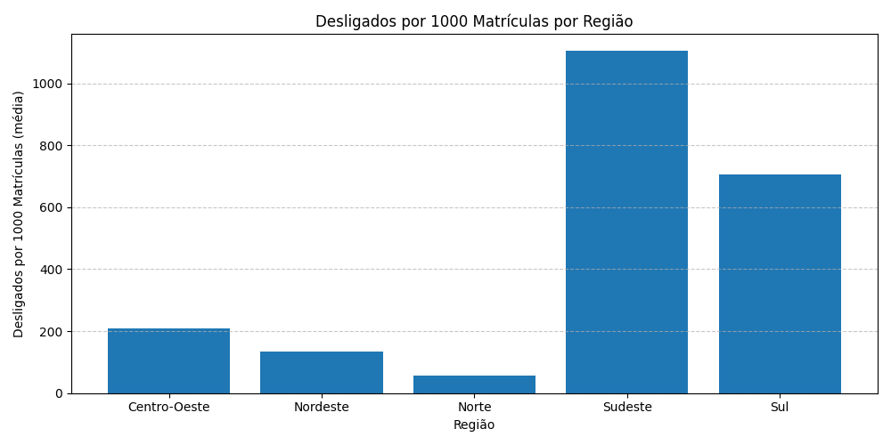
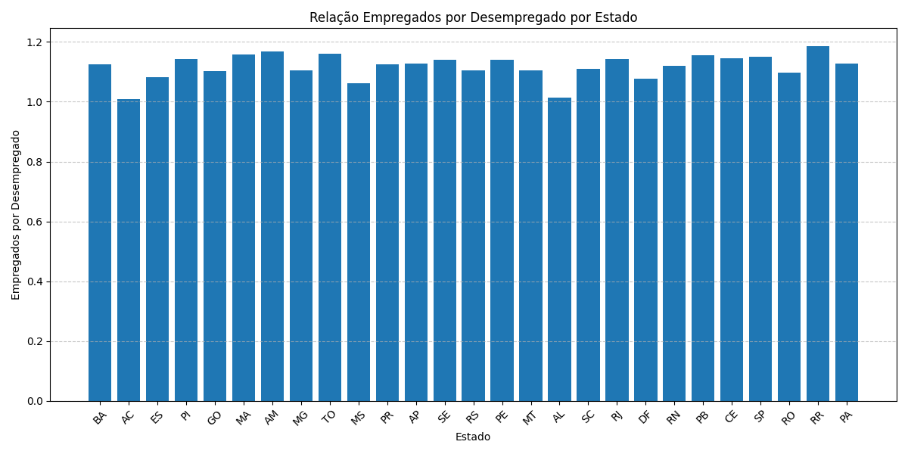
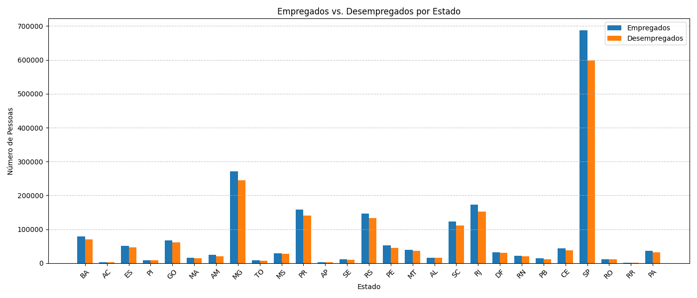
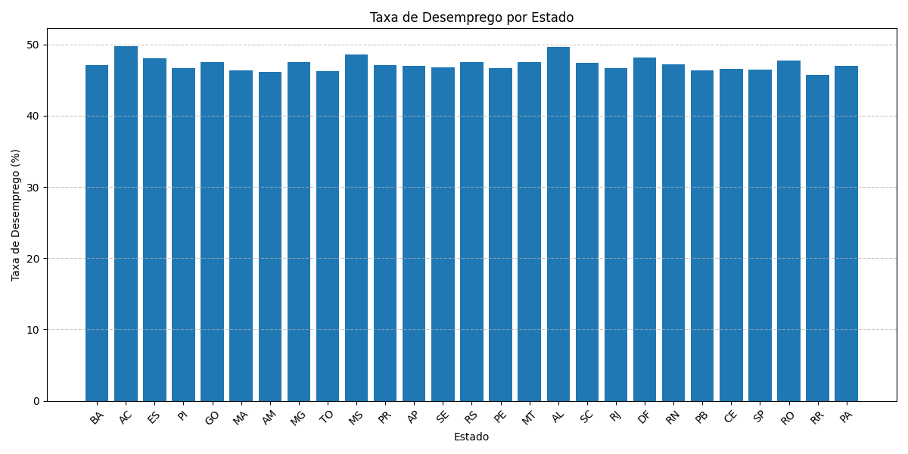

# 📊 Relatório Final do Projeto
## Macro Data Analytics — Análise do Mercado de Trabalho e Educação no Brasil

### 1. Introdução

Este projeto tem como objetivo realizar uma análise aprofundada da situação do mercado de trabalho e da educação no Brasil, integrando dados de empregados, desempregados, matrículas, deficiência e raça para explorar as correlações entre empregabilidade e fatores socioeducacionais.

**Repositório do Projeto:**  
🔗 [MacroDataAnalytics](https://github.com/kalebeasilvadev/MacroDataAnalytics)

**Base de Dados:**  
📂 [Google Drive - Dados Originais](https://drive.google.com/drive/folders/1pL3iHBbYimltFkpazurPgK9iAbTMj9os?usp=sharing)

---

### 2. Metodologia

#### 2.1 Preparação dos Dados

Os dados brutos foram tratados e analisados através de notebooks Python presentes no repositório. As etapas incluíram:
- Leitura e consolidação de diferentes bases CSV.
- Limpeza de dados, tratamento de valores ausentes e padronização de colunas.
- Criação de novas métricas derivadas:
  - Desligados por 1000 matrículas (indicador de rotatividade por região).
  - Empregados por desempregado (indicador de resiliência do mercado de trabalho).
- Cruzamento entre dados de emprego, deficiência e raça para identificar desigualdades estruturais.

#### 2.2 Análises Realizadas

Foram conduzidas as seguintes análises:
- Taxa de desemprego por estado
- Comparação entre empregados e desempregados por estado
- Relação empregados por desempregado
- Desligados por 1000 matrículas por região
- Análises cruzadas por raça
- Análises cruzadas por deficiência

#### 2.3 Visualizações Criadas

As visualizações foram fundamentais para interpretar os dados. Entre elas:

- **Desligados por 1000 Matrículas por Região**
  

- **Relação Empregados por Desempregado por Estado**
  

- **Empregados vs. Desempregados por Estado**
  

- **Taxa de Desemprego por Estado**
  

---

### 3. Resultados e Insights

#### 3.1 Sumário Executivo

- O desemprego é um problema generalizado, com variações significativas entre estados e grupos raciais.
- Correlação clara entre educação (matrículas) e desemprego.
- Grupos raciais e pessoas com deficiência apresentam disparidades que precisam de atenção específica.

#### 3.2 Regiões Críticas

- **Taxa de Desemprego Alta:** AL (49,64%), AC (49,76%), MS (48,52%).
- **Estados com mais desempregados:** SP (597.715), MG (244.788), RJ (151.727).

#### 3.3 Grupos Sociais Impactados

- **Grupos Raciais:**
  - Raça 8.0 concentrada no Nordeste e estados do Norte.
  - Raça 9.0 aparece com presença relevante no Sudeste e Sul.

- **Pessoas com Deficiência:**
  - A análise mostra desafios semelhantes aos enfrentados por outros grupos vulneráveis, exigindo análises mais profundas.

#### 3.4 Educação como Fator Crítico

- Estados como SP, MG e PR apresentaram altos índices de desligados por matrícula, sugerindo:
  - Alta rotatividade.
  - Oferta ou busca intensa por qualificação profissional.

- Relação entre empregados e desempregados:
  - Mais equilibrada em RR (1.19 empregados por desempregado).
  - Mais desafiadora em AC (1.01 empregados por desempregado).

---

### 4. Conclusão

O projeto revelou que as disparidades regionais e sociais no Brasil são marcantes e afetam diretamente a empregabilidade.  
A relação entre educação e empregabilidade, assim como as diferenças entre estados e grupos sociais, mostram caminhos para políticas públicas mais direcionadas.

Recomenda-se aprofundar as análises para:
- Investigar as causas das disparidades por raça e deficiência.
- Estudar o impacto da formação educacional na empregabilidade por estado.
- Propor ações de inclusão produtiva específicas para regiões mais críticas.

---

### 5. Referências

- **Repositório do Projeto:** [MacroDataAnalytics](https://github.com/kalebeasilvadev/MacroDataAnalytics)
- **Base de Dados:** [Google Drive - Dados Originais](https://drive.google.com/drive/folders/1pL3iHBbYimltFkpazurPgK9iAbTMj9os?usp=sharing)
- **Documentos Gerados:**
  - `analise_final.csv`
  - `analise_geral.csv`
  - `analise_por_deficiencia.csv`
  - `analise_por_raca.csv`
  - `insights_gerados_llm.txt`

---

